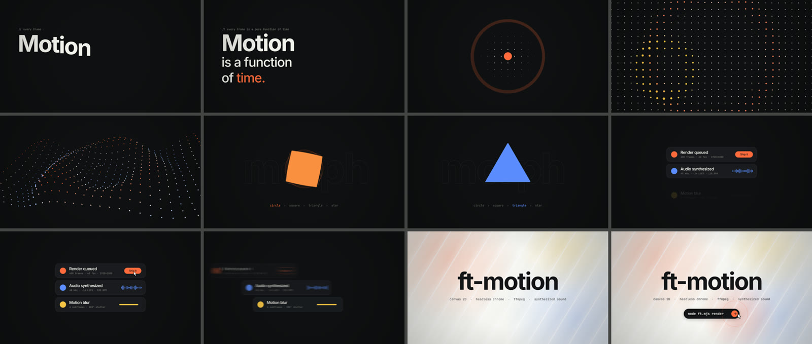

# ft-motion

**Motion graphics as a pure function of time.** You write scenes as `draw(ctx, t)` in plain Canvas 2D. They render in headless Chrome with real motion blur, get encoded with ffmpeg, and are scored with sound synthesized in Python on the same beat grid. There's no timeline editor, no keyframes and no plugins, which makes it a good fit for coding agents: describe the video, review the storyboard, get an mp4.



*Frames from [`examples/hello`](examples/hello): kinetic type → dot field → 3D landscape → shape morph → spring UI → glass end card.*

[Türkçe README](README.tr.md)

## Why

- **Deterministic.** Every frame depends only on `t`, so any frame can be rendered, inspected and fixed in isolation.
- **Real motion blur.** Each output frame averages 6 subframes across a 180° shutter, and hard cuts stay hard.
- **Sound locked to picture.** `audio/ftsynth.py` builds drums, pads, UI foley, whooshes and risers from numpy on the same clock. Risers land exactly on the drop. Mastering targets -14 LUFS.
- **Built for agents.** [`prompts/VIDEO_BRIEF.md`](prompts/VIDEO_BRIEF.md) is a complete brief-to-delivery prompt (research → concepts → beat-grid storyboard → build → visual QA → sound → render). [`CLAUDE.md`](CLAUDE.md) gives the house rules.

## Requirements

- Node.js 18+
- Python 3.10+ with `numpy` and `scipy` (`pip install -r requirements.txt`)
- ffmpeg on your `PATH`
- Google Chrome, Chromium or Microsoft Edge (auto-detected, or set `CHROME_PATH`)

## Quick start

```bash
npm install
pip install -r requirements.txt

node ft.mjs preview examples/hello        # live preview in your browser
node ft.mjs sheet examples/hello 12       # contact sheet → examples/hello/out/sheet.png
python examples/hello/sound.py            # soundtrack → examples/hello/out/audio.wav
node ft.mjs render examples/hello         # → examples/hello/out/hello.mp4
```

Start your own:

```bash
node ft.mjs new launch-teaser             # copies templates/blank → examples/launch-teaser
node ft.mjs preview examples/launch-teaser
```

## Make a video with an agent

1. Open this repo in Claude Code (or another coding agent).
2. Paste [`prompts/VIDEO_BRIEF.md`](prompts/VIDEO_BRIEF.md) (Turkish: [`VIDEO_BRIEF.tr.md`](prompts/VIDEO_BRIEF.tr.md)), fill in the brief, and attach your logo, screenshots and website URL.
3. Pick a concept and approve the storyboard. The agent builds, checks its own frames, scores the sound and renders.

## A scene in 20 lines

```js
// examples/my-video/scene.js
import { prog, rgba, EASE, spring, setFont, TAU } from '../../engine/core.js';

export default {
  draw(ctx, t, api) {
    const { W, H } = api;
    ctx.fillStyle = '#0c0c0e'; ctx.fillRect(0, 0, W, H);

    const p = EASE.expo(prog(t, 0.1, 0.9));                 // 0→1 between 0.1 s and 0.9 s
    setFont(ctx, 700, 120, 'Inter', -4); ctx.textAlign = 'center';
    ctx.save(); ctx.beginPath(); ctx.rect(0, H / 2 - 130, W, 175); ctx.clip();
    ctx.fillStyle = '#f0f0ec'; ctx.fillText('Hello.', W / 2, H / 2 + 40 + (1 - p) * 150);
    ctx.restore();

    const s = spring(t - api.at(1), 16, 7);                 // springs in on bar 1
    ctx.fillStyle = '#ff6a3d'; ctx.beginPath(); ctx.arc(W / 2, H / 2 + 160, 18 * s, 0, TAU); ctx.fill();
  },
};
```

`project.json` sets the canvas, timing and fonts:

```json
{
  "name": "my-video", "width": 1080, "height": 1080, "fps": 60, "duration": 15,
  "bpm": 160, "speed": 1, "subframes": 6,
  "fonts": { "css": ["@fontsource/inter/700.css"], "preload": ["700 40px Inter"] }
}
```

- `bpm` defines the grid: `api.at(bar, step)` gives scene time, and at 160 BPM one bar is 1.5 s.
- `speed` stretches the whole choreography. `0.75` turns a 15 s cut into 20 s, and the sound follows.
- Fonts: any `@fontsource/*` package (`npm i @fontsource/<font>`), or CSS files inside the project folder.

## CLI

| Command | What it does |
|---|---|
| `node ft.mjs new <name>` | scaffold `examples/<name>` |
| `node ft.mjs preview <project>` | live player: space play/pause, ←/→ frame, shift+←/→ second, `b` motion blur, `&t=3.5` to freeze |
| `node ft.mjs stills <project> 0,90,2.5s` | full-size PNGs at frames or seconds |
| `node ft.mjs sheet <project> [n]` | `n` evenly spaced stills tiled into `out/sheet.png` |
| `node ft.mjs render <project>` | mp4 (H.264, yuv420p, faststart; muxes `out/audio.wav` if present) |

Options: `--lang xx` (passed to the scene as `api.lang`), `--sub N` (motion-blur subframes), `--crf N`, `--out name.mp4`.

## Layout

```
engine/core.js        helpers + motion-blur runtime
engine/three.js       three.js bridge: offscreen WebGL, cel shading, ink outlines, sweep tubes
engine/brand.js       brand kit: palette from 3 colours, safe areas, text fitting, logo / monogram
engine/player.html    loads a project's fonts + scene (preview and render)
ft.mjs                CLI: static server, headless Chrome, ffmpeg
audio/ftsynth.py      synthesis, timeline mixer, reverb, sidechain, mastering
templates/blank/      starting point for `new`
examples/hello/       reference scene + soundtrack
examples/cat-crossing/ 3D cartoon short (three.js): a cat crossing a busy street
examples/chat-commerce/ conversational-commerce promo: chat demo, manifesto, inbox, dots → logo, glass end card
examples/motion-principles/ kinetic manifesto: code → dot landscape → timing, rhythm, contrast, squash, morph
docs/TECHNIQUES.md    recipes: timing, type, dot fields, morphs, UI, glass, impacts, sound
prompts/              brief-to-video prompt templates (EN / TR)
```

## 3D scenes with three.js

A scene can build a three.js world in `setup()` and pose it from `t` in `draw()`; [`engine/three.js`](engine/three.js) renders it into an offscreen WebGL canvas and blits it onto the frame, so motion blur, `post()` and 2D overlays keep working. `import * as THREE from 'three'` and `three/addons/…` resolve from `node_modules` through the player's import map. Headless renders use SwiftShader (software WebGL), which is deterministic but slow (roughly 0.5–1 s per subframe at 1080p), so lower `subframes` for heavy 3D projects. See [`examples/cat-crossing`](examples/cat-crossing) and the three.js section in [`docs/TECHNIQUES.md`](docs/TECHNIQUES.md).

## Brandable examples

[`examples/chat-commerce`](examples/chat-commerce) and [`examples/motion-principles`](examples/motion-principles) are 20-second promos (also templates in ft-studio). Everything a brand changes sits at the top of `scene.js`: the `COPY` dictionary (TR / EN, pick with `--lang tr`) and `BRAND` (three colours, display font, optional logo file). [`engine/brand.js`](engine/brand.js) turns those into a palette with guaranteed contrast, a safe area for any aspect ratio (change `width` / `height` in `project.json` for 9:16, 4:5 or 16:9) and a logo, with a monogram when there is no file. Both are choreographed on a 15 s clock and play at `"speed": 0.75`; set `1` for the original 15 s tempo or `0.6` for 25 s, and the soundtrack follows.

```bash
node ft.mjs sheet examples/chat-commerce 12 --lang tr
python examples/chat-commerce/sound.py
node ft.mjs render examples/chat-commerce --lang tr
```

## Tips

- Leave film grain out. It multiplies file size and every platform re-encodes it into blotches.
- Square (1080×1080) reads best in phone feeds. For Reels/Stories use 1080×1920 and keep about 250 px clear at the top and bottom.
- On Windows, keep the repo in a short path. Very long paths break some git and ffmpeg operations.

## License

MIT (see [LICENSE](LICENSE)). Fonts are distributed under their own licenses (Inter and JetBrains Mono: SIL Open Font License).
